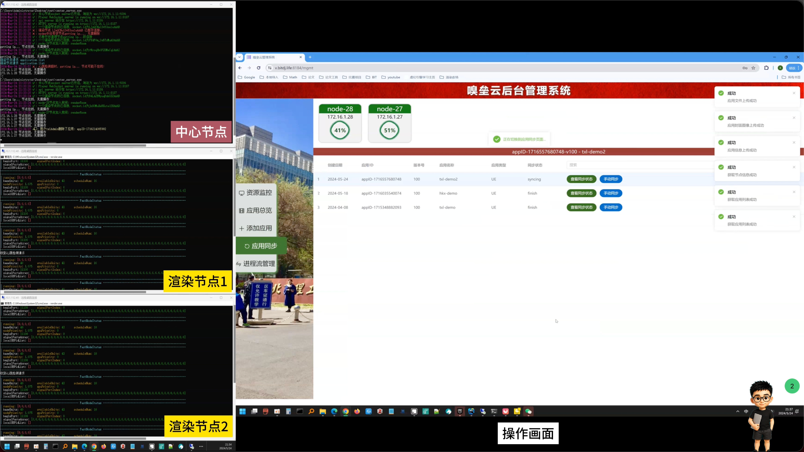

# xiuleiyun-admin-web

[中文](README.md)


`xiuleiyun-admin-web` is a Vue 3, Vite, Pinia, and Element Plus admin frontend for application resource management, uploads, cover management, node status views, synchronization actions, and login-based access control.

## Preview



## Features

- Login flow with persisted local token state.
- Application list, create, edit, delete, and manual sync workflows.
- Chunked application package uploads, cover uploads, and metadata submission.
- Node and streamer status views with streamer disconnect actions.
- Element Plus based admin UI with loading and message feedback.
- Environment-based backend API configuration, so deployment endpoints are not hardcoded in source.

## Requirements

- Node.js 18 or newer.
- pnpm 9 or a compatible version.

## Installation And Configuration

```sh
pnpm install
cp .env.example .env.local
```

Edit `.env.local` and set `VITE_API_BASE_URL` to your backend service origin. If the frontend and backend are deployed under the same origin, leave the value empty so requests use the current site origin.

## Configuration

| Variable | Required | Description | Example |
| --- | --- | --- | --- |
| `VITE_API_BASE_URL` | No | Backend API origin. When empty, requests use the current site origin. | `https://api.example.com` |

## Usage

Start the development server:

```sh
pnpm dev
```

Build for production:

```sh
pnpm build
```

Preview the production build locally:

```sh
pnpm preview
```

## Development

Run lint checks:

```sh
pnpm lint
```

Fix auto-fixable ESLint issues:

```sh
pnpm lint:fix
```

Format source files:

```sh
pnpm format
```

## Privacy And Security

- Local environment files such as `.env` and `.env.local` are ignored by `.gitignore`; do not commit real backend URLs, accounts, tokens, or other sensitive data.
- `.env.example` contains placeholder configuration only and is safe to copy for local setup.
- `dist/`, caches, logs, and temporary directories are ignored to keep generated output and local runtime state out of the repository.
- This admin app persists the login token in the browser, so use it only in trusted environments.

## License

No license is declared in this repository yet. Add an appropriate `LICENSE` file before publishing it as open source.
